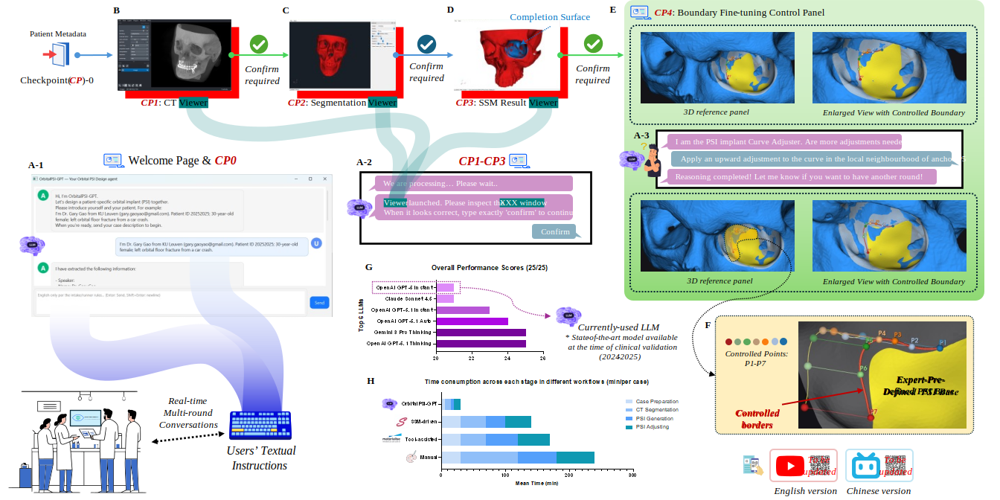

# Designing Patient-Specific Orbital Implants with Just Your Words

Code repository for **OrbitalPSI-GPT**, accompanying the work:

> **A Text-Driven Clinician-in-the-Loop Approach to Accessible Patient-Specific Orbital Implant Design in Low-Resource Settings.**

---

## 🎥 Demo Video

[](https://doi.org/10.5281/zenodo.17936808)

## ✅ Clinician-in-the-loop Workflow

We break the design process into a few simple checkpoints (CP0–CP4).  
You stay in control from start to finish — using just your words.

1. **CP0 — Case setup: Tell the system what’s going on**  
   You start by giving a short description of the case (which side, what type of defect, etc.).  
   The system automatically extracts the key information and prepares the case for you.

2. **CP1–CP2 — Anatomy check: Make sure the “map” is correct**  
   The system loads the CT scan and the segmentation results.  
   You quickly look at the 3D view to confirm everything is labelled correctly.  
   👉 **If you don’t approve it, the system will not generate any implant.**

3. **CP3 — First draft: The system creates an initial implant shape**  
   Using a statistical shape model and/or expert-designed templates mapped to the patient’s orbit, the system generates a smart “first draft” implant surface that roughly fits the defect.  
   You review this baseline — and only after you say **“Confirm”** in the chat does the system move on.

4. **CP4 — Chat & adjust: Refine the boundaries through simple text commands**  
   Now comes the interactive part. You talk to the system to fine-tune the template-based implant, for example:  
   > “Move the inner wall edge 2 mm inward.”  
   > “Undo all changes!”  

   The system interprets your text and updates the 3D model in real time. You can go back and forth as many times as needed until it looks right.

---

## 🧠 System Overview

OrbitalPSI-GPT enables surgeons to design patient-specific orbital implants through natural-language instructions, without requiring CAD expertise or proprietary software, particularly in low-resource settings.
For more information or technical details, please refer to our paper (to be updated upon publication):  




---

## 📚 Citation

If you use **OrbitalPSI-GPT** in your research or clinical work, please cite:

> Gao Y, *et al.*  
> **“A Text-Driven Clinician-in-the-Loop Approach to Accessible Patient-Specific Orbital Implant Design in Low-Resource Settings.”**  
> 2025. (Manuscript in preparation)

### BibTeX (update when the paper is accepted)

```bibtex
@article{gao2025orbitalpsigpt,
  title   = {A Text-Driven Clinician-in-the-Loop Approach to Accessible Patient-Specific Orbital Implant Design in Low-Resource Settings},
  author  = {Yao Gao et al.},
  year    = {2025},
  note    = {Manuscript in preparation},
}
