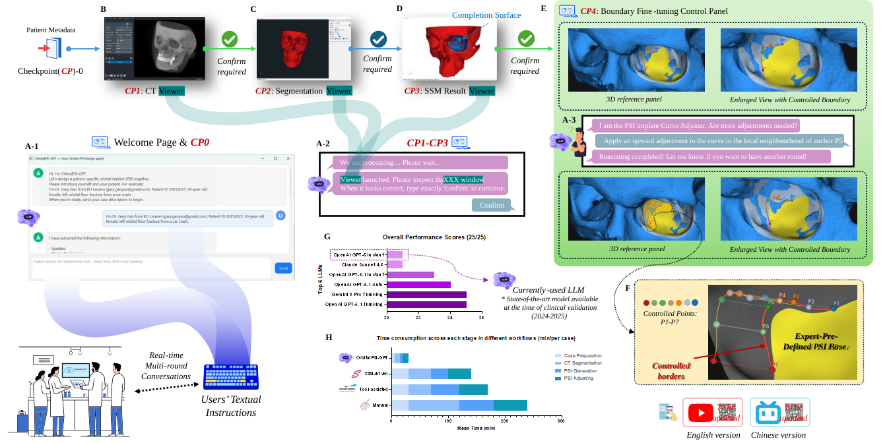

<div align="center">

# OrbitalPSI-GPT

### Text-Driven Clinician-in-the-Loop Patient-Specific Orbital Implant Design

<br>

[](#citation)
[](https://doi.org/10.5281/zenodo.17936808)
[](LICENSE)
[](https://www.python.org/)

<br>

**OrbitalPSI-GPT** is a research framework that enables clinicians to inspect, generate, and iteratively refine patient-specific orbital implant geometries through natural-language interaction.

<br>

> **A Text-Driven Clinician-in-the-Loop Approach to Accessible Patient-Specific Orbital Implant Design in Low-Resource Settings**
> *Yao Gao et al.*
> **Manuscript under review**

<br>

[**Demo Video**](#-demo-video) ·
[**Workflow**](#-clinician-in-the-loop-workflow) ·
[**Models & Assets**](#-models--assets) ·
[**Citation**](#-citation) ·
[**Contact**](#-contact)

</div>

---

## 🧠 Overview

**OrbitalPSI-GPT** connects natural-language interaction with a structured 3D orbital implant design workflow.

The system is designed to allow clinicians to:

* inspect patient-specific orbital anatomy;
* review automated anatomical reconstruction;
* synthesize an initial implant geometry;
* iteratively modify design boundaries through text instructions; and
* retain supervisory control throughout the complete workflow.

The framework is intended to **reduce dependence on specialized CAD expertise and proprietary planning infrastructure**, particularly in resource-constrained research and surgical environments.

<br>

<p align="center">
  
</p>

<p align="center">
  <sub>
    Overview of the OrbitalPSI-GPT clinician-in-the-loop design framework.
  </sub>
</p>

> [!NOTE]
> The manuscript and Supplementary Information describe the research version evaluated in the study.
> **This GitHub repository serves as the primary source for evolving code, implementation updates, model checkpoints, and reproducibility resources.**

---

## ⚠️ Research & Regulatory Notice

> [!CAUTION]
>
> ### FOR INVESTIGATIONAL AND RESEARCH PURPOSES ONLY
>
> **OrbitalPSI-GPT is an experimental academic prototype. It is not a certified medical device and is not intended for autonomous clinical diagnosis, treatment, or surgical execution.**

<details>
<summary><strong>Read the full regulatory and clinical disclaimer</strong></summary>

<br>

### Medical-device status

OrbitalPSI-GPT has not been certified, cleared, or approved as a medical device under:

* EU Medical Device Regulation **2017/745**;
* U.S. FDA medical-device pathways; or
* other regional medical-device regulatory frameworks.

### Clinical responsibility

Outputs generated by the framework must not be interpreted as autonomous clinical recommendations.

The authors, contributors, and affiliated institutions assume no responsibility for consequences resulting from unauthorized, inappropriate, or unvalidated clinical use of the software or generated geometries.

### Regulatory and ethical compliance

Any downstream translation, preclinical investigation, deployment, or implant fabrication must comply with applicable:

* institutional governance requirements;
* local and national regulations;
* medical-device legislation;
* data-protection requirements; and
* Institutional Review Board / Ethics Committee approvals.

### Mandatory clinician verification

Automated and generative components may introduce:

* segmentation errors;
* geometric inaccuracies;
* inappropriate anatomical interpretations; or
* unexpected mesh modifications.

All segmentation masks, reconstructed anatomy, implant boundaries, fixation components, and exported meshes therefore require **independent review by appropriately qualified professionals** before any downstream use.

</details>

---

## 🎥 Demo Video

<div align="center">

### Zenodo Research Record

[](https://doi.org/10.5281/zenodo.17936808)

**DOI:** `10.5281/zenodo.17936808`

</div>

<details>
<summary><strong>Availability & Early-Access Protocol</strong></summary>

<br>

| Item                  | Status                                              |
| --------------------- | --------------------------------------------------- |
| **Current access**    | 🔒 Restricted during manuscript review              |
| **Planned release**   | 🌐 Public following formal publication              |
| **Persistent record** | ✅ Version-controlled Zenodo DOI                     |
| **Early access**      | Available to reviewers and researchers upon request |

Peer reviewers and researchers may request access through the Zenodo portal or contact:

`gary.gaoyao@gmail.com`

</details>

---

## ✅ Clinician-in-the-Loop Workflow

The complete workflow is organized around deterministic checkpoints **CP0–CP4**.

The clinician retains supervisory oversight and veto authority throughout the design process.

```text
┌─────────────────────┐
│  CP0 · Case Setup   │
└──────────┬──────────┘
           │
           ▼
┌─────────────────────────────┐
│ CP1–CP2 · Anatomy Review    │
└──────────┬──────────────────┘
           │
           ▼
┌─────────────────────────────┐
│ CP3 · Baseline Synthesis    │
└──────────┬──────────────────┘
           │
           ▼
┌─────────────────────────────┐
│ CP4 · Text-Driven Editing   │
└──────────┬──────────────────┘
           │
           ▼
┌─────────────────────────────┐
│ Clinician Review / Export   │
└─────────────────────────────┘
```

### `CP0` — Case Setup

The clinician provides a concise natural-language description of the case, including relevant information such as:

* defect laterality;
* fracture extent;
* anatomical considerations; and
* reconstructive requirements.

The system extracts the required information and initializes the reconstruction workspace.

---

### `CP1–CP2` — Anatomy Verification

Patient CT data and automatically generated anatomical models are presented for inspection.

> [!IMPORTANT]
> **Clinician approval is mandatory.**
> Implant synthesis does not proceed until the reconstructed anatomy has been explicitly reviewed and approved.

If the anatomy is considered inadequate, the workflow must be corrected or terminated before implant generation.

---

### `CP3` — Baseline Implant Synthesis

A baseline implant geometry is generated using the reconstructed anatomical reference and corresponding geometric design components.

The clinician reviews the initial geometry before proceeding to interactive refinement.

---

### `CP4` — Text-Driven Refinement

The clinician can iteratively modify implant geometry through conversational instructions.

Examples:

```text
Extend the posterior boundary by 1.5 mm.
```

The geometry is regenerated after each accepted instruction and returned for subsequent inspection.

---

## 📦 Models & Assets

### Availability Overview

| Resource                        |           Status           | Distribution                  |
| ------------------------------- | :------------------------: | ----------------------------- |
| **Source Code**                 | 🟢 Public / staged release | GitHub                        |
| **Benchmark Utilities**         | 🟢 Public / staged release | GitHub                        |
| **Standalone Desktop Software** |      🟡 In preparation     | Planned release               |
| **ALD Dataset**                 |      🟡 In preparation     | Release information to follow |
| **Public ALD Weights**          |   🟡 Training in progress  | Open release                  |
| **Clinical Production Weights** |        🔒 Restricted       | Controlled access             |
| **Clinical SSM**                |        🔒 Restricted       | Institutional agreement / DTA |

---

### 🖥️ Standalone Software

A portable desktop implementation is being prepared for research deployment.

Planned features include:

* Windows standalone executable;
* no local Python environment required for standard use;
* simplified research-oriented interface;
* integrated clinician review checkpoints; and
* automated export of research design outputs.

> **Release status:** Download links will be activated when the corresponding software package becomes publicly available.

---

### 🔒 Restricted Clinical Models

Certain model weights and statistical shape models were developed using institutionally governed clinical data.

These resources cannot be distributed as unrestricted public downloads.

| Asset                           | Development Source                       | Access                                          |
| ------------------------------- | ---------------------------------------- | ----------------------------------------------- |
| **Clinical Production Weights** | UZ Leuven clinical research cohort       | [Model Access Request](MODEL_ACCESS_REQUEST.md) |
| **Statistical Shape Model**     | Institutionally governed clinical cohort | Institutional agreement / DTA                   |

---

### 🌐 Public Baseline Weights

To support reproducibility and reduce dependence on institution-specific clinical datasets, independent baseline models are being trained using curated open-access craniofacial imaging resources.

**Status:** `Training in progress`

Planned releases include:

* model checkpoints;
* training configurations;
* inference scripts;
* evaluation utilities;
* training logs;
* benchmark results; and
* reproducibility documentation.

> ⭐ **Star** or **Watch** this repository to receive notifications when new public checkpoints and resources are released.

---

## 🗂️ Repository Structure

```text
OrbitalPSI-GPT/
│
├── assets/                 # Repository graphics and figures
├── configs/                # Configuration files
├── models/                 # Model definitions and interfaces
├── modules/                # Core computational modules
├── scripts/                # Training / inference / evaluation
├── examples/               # Demonstration cases
├── docs/                   # Extended documentation
│
├── MODEL_ACCESS_REQUEST.md
├── LICENSE
└── README.md
```

> The repository structure may evolve as additional research components are released.

---

## 🔄 Reproducibility & Versioning

OrbitalPSI-GPT is under active development.

The manuscript and Supplementary Information describe the specific research version evaluated in the corresponding study.

Subsequent GitHub releases may include:

* implementation refinements;
* software bug fixes;
* dependency updates;
* interface improvements;
* new public model weights;
* additional validation utilities; and
* extended documentation.

For exact reproduction of published experiments, users should refer to the **release tag associated with the final publication**.

---

## 📚 Citation

If you use **OrbitalPSI-GPT** or its associated methodological components in academic research, please cite the corresponding study.

> **Gao Y, et al.**
> *A Text-Driven Clinician-in-the-Loop Approach to Accessible Patient-Specific Orbital Implant Design in Low-Resource Settings.*
> 2026. Manuscript under review.

The final journal citation and DOI will be added following publication.

### BibTeX

```bibtex
@article{gao2026orbitalpsigpt,
  title  = {A Text-Driven Clinician-in-the-Loop Approach to Accessible Patient-Specific Orbital Implant Design in Low-Resource Settings},
  author = {Gao, Yao and others},
  year   = {2026},
  note   = {Manuscript under review}
}
```

### Software / Demo Record

**Zenodo DOI:**
https://doi.org/10.5281/zenodo.17936808

---

## 📄 License

Unless otherwise specified, publicly released source code is distributed under the terms of the repository [LICENSE](LICENSE).

The software license does **not** override restrictions applicable to:

* clinical datasets;
* controlled-access model weights;
* institutional statistical shape models;
* third-party datasets; or
* third-party software dependencies.

---

## 📬 Contact

For technical questions, reproducibility issues, model-access requests, or research collaborations:

<div align="center">

**Yao (Gary) Gao**
Lead Developer / Corresponding Researcher

`yao.gao@kuleuven.be`

<br>

For bugs and feature requests, please use **GitHub Issues**.

</div>

---

<div align="center">

### OrbitalPSI-GPT

**Text-driven · Clinician-supervised · Research-oriented**

<sub>
Research software for accessible patient-specific orbital implant design
</sub>

</div>
